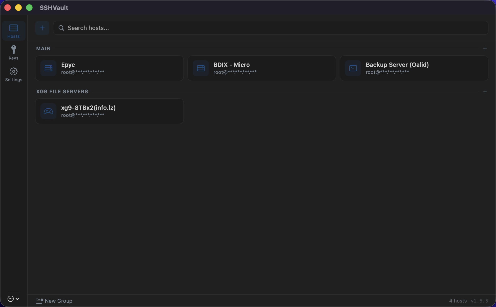
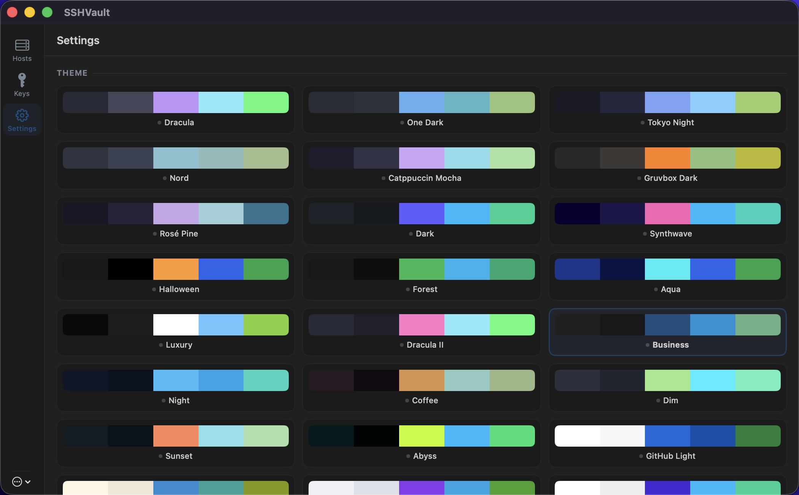

# SSHVault

A native macOS SSH connection manager built with SwiftUI. Manage your `~/.ssh/config` hosts, organize them into groups, generate SSH keys, and connect with your preferred terminal — all from a clean, themeable interface.






## Features

### Host Management
- **Visual SSH config editor** — reads and writes your `~/.ssh/config` directly
- **Host tiles** in a responsive 3-column grid with hover interactions
- **Custom display names** — set a friendly label separate from the SSH alias
- **Custom icons** — assign SF Symbol icons to individual hosts
- **Double-click to connect** — launches SSH in your preferred terminal
- **Drag-and-drop grouping** — organize hosts into named groups
- **SFTP support** — open SFTP in your system file manager from the context menu, with configurable initial paths
- **Import / Export** — share or backup your SSH config
- **Termius link import** — import hosts from `ssh://` links
- **Automatic backups** — creates `~/.ssh/config.bak` before every save

### Privacy
- **IP masking toggle** — hide IP addresses / hostnames on host tiles with `***.***.***.***` (Settings > Display)

### SSH Key Management
- **Key discovery** — scans `~/.ssh/` and displays all key pairs with fingerprints
- **Key generation** — create Ed25519, RSA (4096-bit), or ECDSA keys
- **Copy public key** — one-click copy to clipboard
- **Deploy keys** — `ssh-copy-id` integration from the host context menu

### Terminal Integration
- **Ghostty** (direct binary launch)
- **Terminal.app** (AppleScript)
- **iTerm2** (AppleScript)
- **Custom app** — point to any terminal binary
- **Per-host overrides** — use a different terminal for specific hosts

### Theming
43 built-in color schemes including daisyUI-inspired themes:

| Dark | Light |
|------|-------|
| Dracula | GitHub Light |
| One Dark | Solarized Light |
| Tokyo Night | Catppuccin Latte |
| Nord | Light |
| Catppuccin Mocha | Cupcake |
| Gruvbox Dark | Bumblebee |
| Rosé Pine | Emerald |
| Synthwave | Corporate |
| Halloween | Retro |
| Forest | Cyberpunk |
| Aqua | Valentine |
| Luxury | Garden |
| Dracula II | Lo-Fi |
| Business | Pastel |
| Night | Fantasy |
| Coffee | CMYK |
| Dim | Autumn |
| Sunset | Acid |
| Abyss | Lemonade |
| Dark | Winter |
| | Nord Light |
| | Caramel Latte |
| | Silk |

Theme selection persists across sessions and updates the entire UI instantly.

## Layout

SSHVault uses a Termius-inspired 3-column layout:

```
┌──────┬───────────────────────┬────────────────────┐
│ [H]  │  [+]  [Search____]    │  Edit Host         │
│ [K]  │                       │                    │
│ [S]  │  GROUP A         [+]  │  Host Alias        │
│      │  ┌─────┐ ┌─────┐     │  HostName          │
│      │  │srv-1│ │srv-2│     │  User              │
│      │  └─────┘ └─────┘     │  Port              │
│      │                       │  Identity File     │
│      │  UNGROUPED            │  ...               │
│      │  ┌─────┐ ┌─────┐     │                    │
│      │  │ dev │ │prod │     │  [Cancel] [Save]   │
│      │  └─────┘ └─────┘     │                    │
│ [:]  │                       │                    │
└──────┴───────────────────────┴────────────────────┘
  56px       flexible                ~380px
```

- **Left rail** — icon navigation: Hosts, Keys, Settings, plus a "More" menu for import/export/reload
- **Center panel** — switches between Hosts (tile grid), Keys, or Settings
- **Right panel** — slides in when editing or adding a host

## Building

**Requirements:** macOS 13+ and Swift 5.9+ (included with Xcode 15+)

```bash
# Clone
git clone https://github.com/LZDevs/SSHVault.git
cd SSHVault

# Build
swift build

# Run
swift run
```

### Build .app Bundle & DMG

```bash
bash scripts/build-app.sh
```

This produces `build/SSHVault.app` and a versioned `build/SSHVault-vX.Y.Z.dmg` with a drag-to-Applications layout.

No external dependencies — just SwiftUI and AppKit.

## Project Structure

```
Sources/
├── App.swift                    # App entry point & window config
├── Theme.swift                  # Theme system (43 themes + ThemeManager)
├── Models/
│   ├── SSHHost.swift            # SSH host model (label, icon, SFTP path)
│   ├── SSHConfig.swift          # Bidirectional ~/.ssh/config parser
│   ├── HostGroup.swift          # Host grouping with JSON persistence
│   └── TerminalConfig.swift     # Terminal & display preferences
├── Services/
│   ├── SSHConfigService.swift   # CRUD operations on SSH config
│   ├── SSHKeyService.swift      # Key discovery, generation, clipboard
│   └── TerminalService.swift    # Terminal launch & SFTP (all terminal types)
└── Views/
    ├── ContentView.swift        # 3-column layout shell
    ├── SettingsView.swift       # Theme picker, display & terminal preferences
    ├── AboutView.swift          # About dialog with version & links
    ├── TermiusImportView.swift  # Import hosts from ssh:// links
    ├── Sidebar/
    │   └── SidebarView.swift    # Host grid, groups, search, drag-drop
    ├── Hosts/
    │   ├── HostRowView.swift    # Host tile card
    │   ├── HostFormView.swift   # Add/edit host form
    │   └── HostDetailView.swift # Host detail view
    └── Keys/
        └── KeyManagementView.swift  # SSH key list, generate, copy
```

## Data Storage

| Data | Location | Format |
|------|----------|--------|
| SSH hosts | `~/.ssh/config` | SSH config |
| Config backup | `~/.ssh/config.bak` | SSH config |
| Host groups | `~/Library/Application Support/SSHVault/groups.json` | JSON |
| Terminal overrides | `~/Library/Application Support/SSHVault/host_terminal_prefs.json` | JSON |
| Theme preference | UserDefaults | String |
| Default terminal | UserDefaults | String |
| Display preferences | UserDefaults | Bool |

## SSH Config Directives

SSHVault parses and preserves these directives:

- `Host` — alias / pattern
- `HostName` — server address
- `User` — login username
- `Port` — connection port
- `IdentityFile` — path to private key
- `ProxyJump` — bastion / jump host
- `ForwardAgent` — agent forwarding toggle

### SSHVault Metadata Comments

SSHVault stores extra metadata as comments in your SSH config (ignored by SSH):

- `# @label` — display name for the host tile
- `# @icon` — SF Symbol name for the host icon
- `# @sftppath` — initial directory for SFTP connections
- `# @sshinitpath` — whether to use SSH init path for SFTP (`no` to disable)

Any unrecognized directives are preserved as-is in "extra options" so your config is never mangled.

## License

MIT
